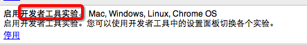

以前就幻想过，为啥我们用浏览器的开发者工具调试页面的样式什么的，不能保存呢，要知道苦逼的前端每每调试多了，根本就是会分分钟忘记刚刚改了哪些属性滴！

帅气的谷歌给了我答案！用chrome的workspace就可以让我们调试的同时，在我们的编辑器里做对应修改。  

正式版的chrome workspace功能并没有默认开启，我们需要进入chrome://flags手动开启对应的"启用开发者工具实验"  
  
启动之后重启chrome，打开开发者工具，进入设置